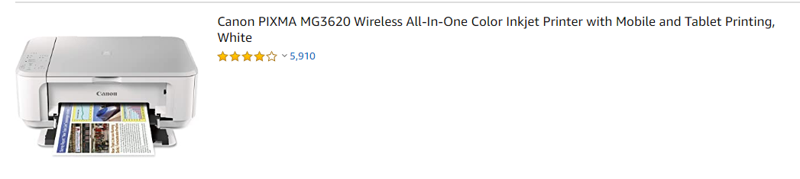

### Amazon webscrapping 
The process and documention written below is based on the web structure of Amazon shopping site on and prior to 5/27/2020.
It may not be working in future if amazon changes its web structure.

##### Result Displaying structure
At the moment, it displays the results in two ways and  they both have different XPath.
1) Only one product(result) in a single row as shown in image below

2) Four products in a single row as shown in image below

 

##### Finding Searched Result
Whenever we search for some items,amazon always displays other results like Amazon's choice,Editorials recommendation,Top rated from our brands and so on together with the searched results.
Searched results always have  data-asin and data-component-type value, while other results do not have such values.
```Html
For instance, if we inspect searched result we can see data-asin and data-component-type with values as shown below.
<div data-asin="B0XXXXXXX" data-component-type="s-search-result" ......>
``` 
